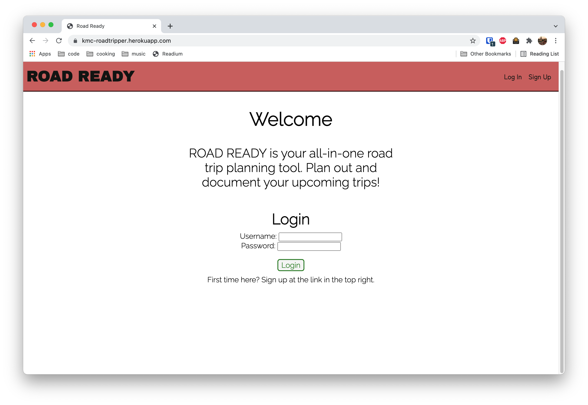
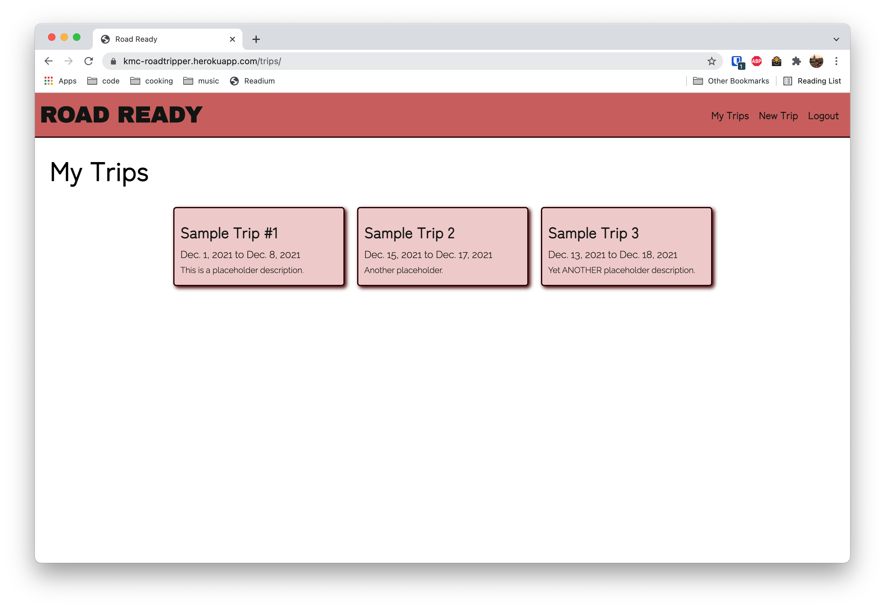
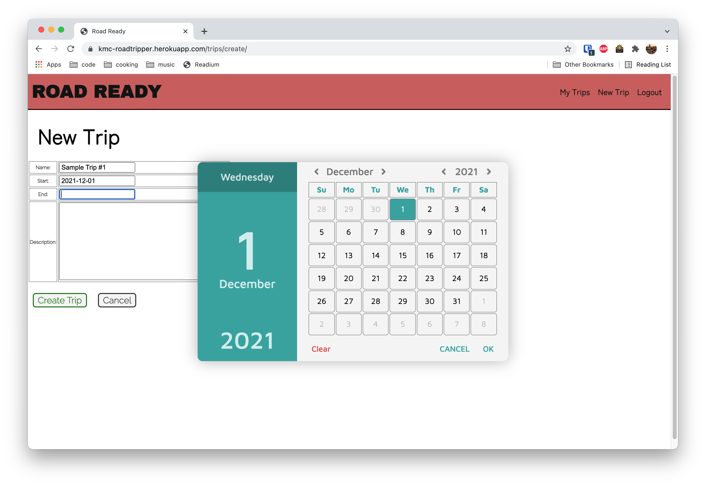
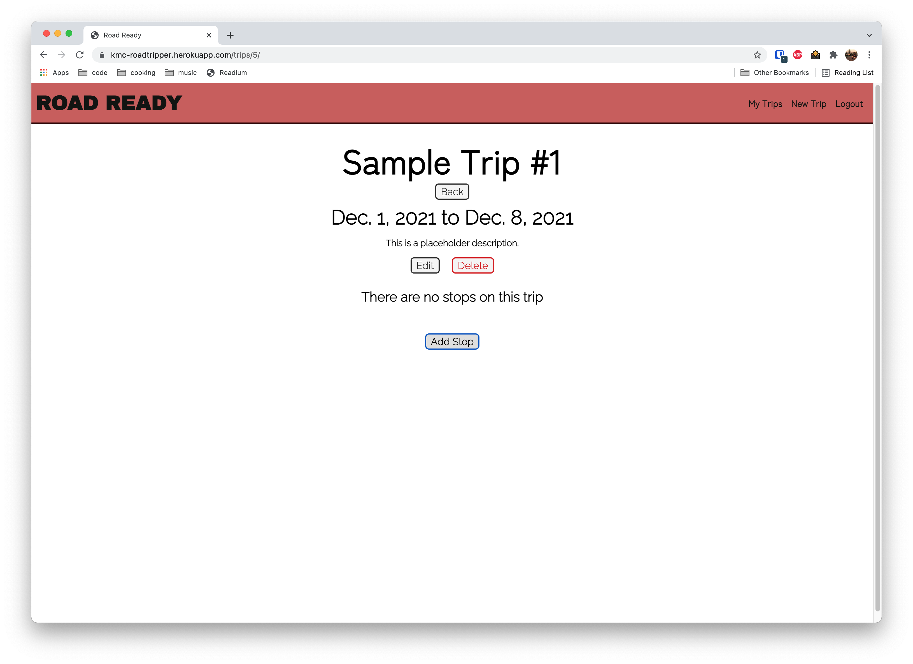
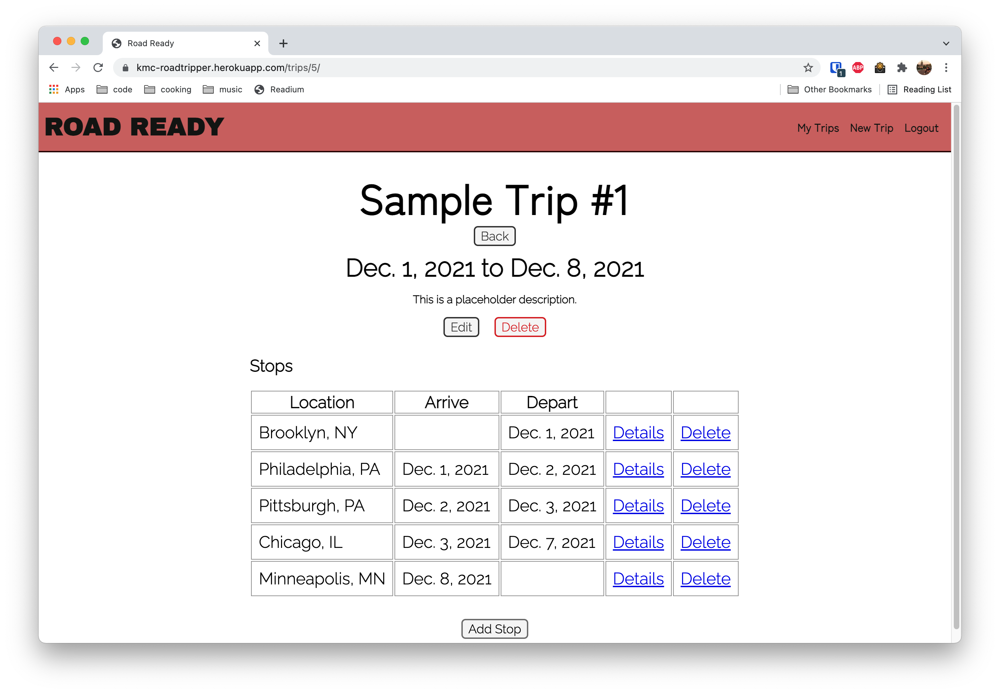
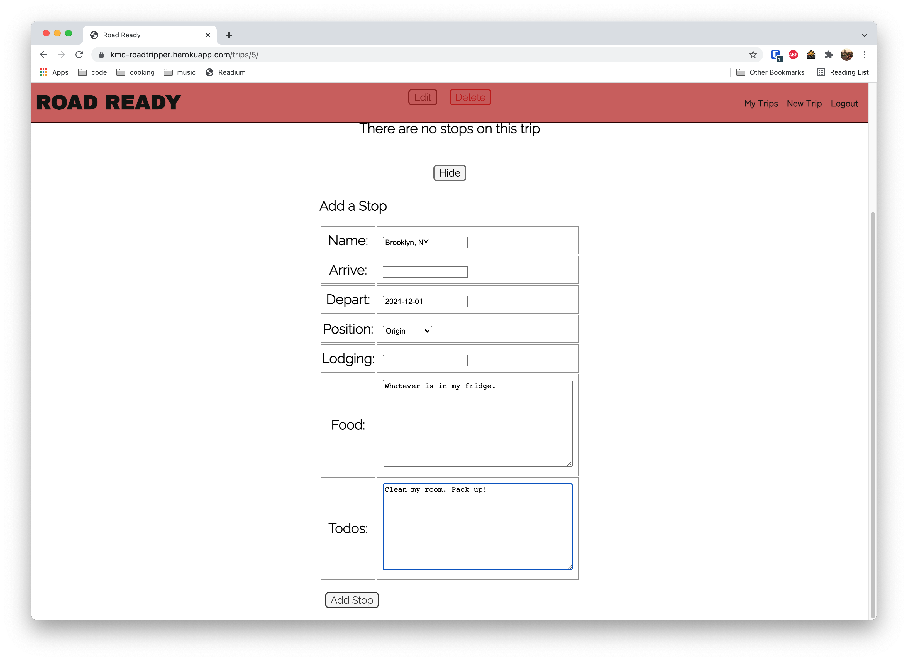
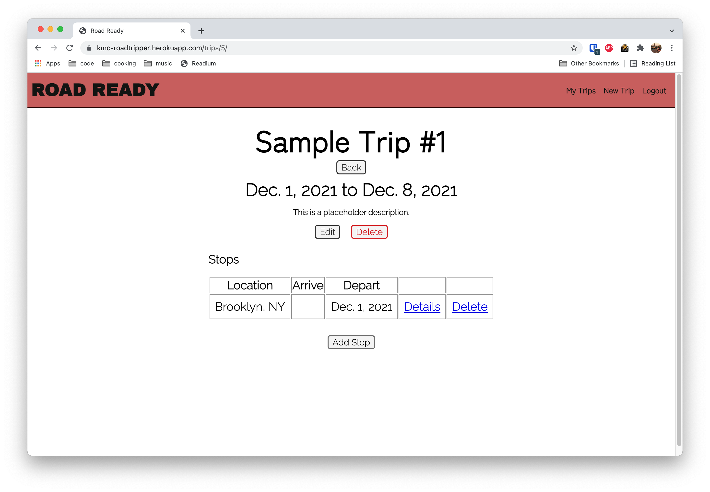
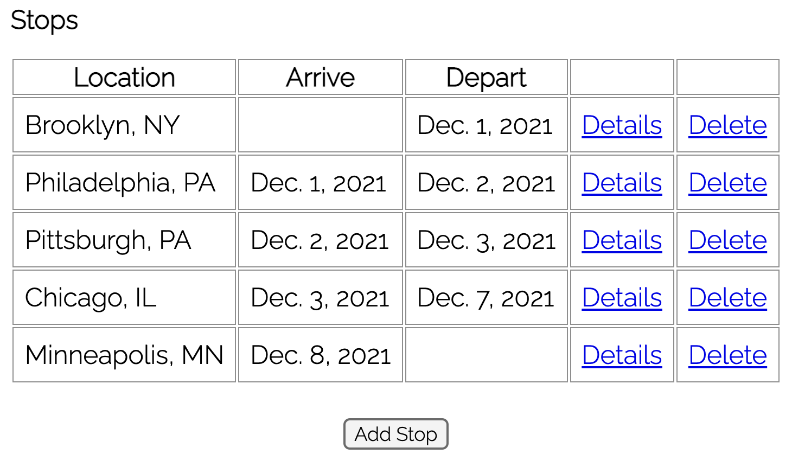
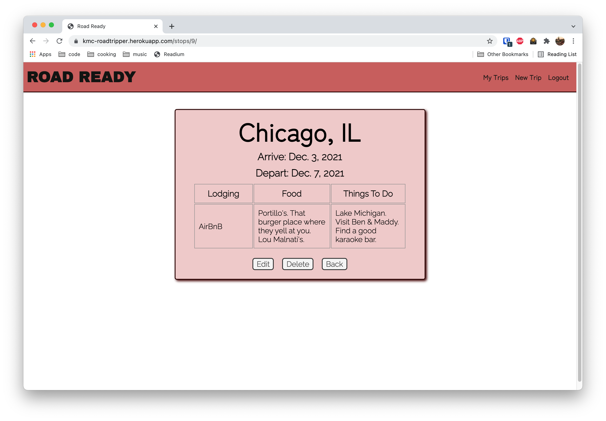

# Road Ready!
Road Ready is a road trip planner and log. You can conveniently store and quickly access all the information you need for your upcoming trips.

## Getting Started
Click [here](https://kmc-roadtripper.herokuapp.com) to launch the app!

## Login/Signup
You will be brought to the home page, and asked to log in. If you have not used the application before, you will need to sign up for an account.

## My Trips
All your trips will live in this index here. If you've just created your account, this page will be blank.

## New Trip
A form will display to set up a new trip.

## Trip Detail
When you select a trip from the index page, you will be taken to its detail page. (Creating a new trip will automatically redirect you to its detail page as well).

New Trip:

Existing trip with stops:

### Add a Stop
Clicking on the "Add Stop" button will reveal the form for adding a stop. The name and position are required, everything else is optional (your origin wouldn't have an arrival date, destination wouldn't have a departure date, etc.) and can be edited later if you please.

Input your information and submit! The stop will display in the list.

No matter what order you add stops in, the origin & destination will display first & last, respectively, and the other stops will be in correct date order.

### Stop Details/Delete
You can view the full details of any stop by clicking the appropriate detail link.

Clicking on the edit button will bring back the form so you can make any changes you may want, including deleting a stop entirely (stops can also be deleted from the trip detail page).

## Technologies Used

- Python
- Django
- Javascript
- HTML
- CSS
- PostgreSQL
- Google Fonts

## The Future...

Mobile responsiveness is currently a work in progress. The overall site frame responds appropriately, but still working out the details of the page contents.

I hope to eventually use an API from Google Maps to have data about driving times between locations.

Overall design could still use a lot of work, I think this is one of my major weak points.

I experimented unsuccessfully with having certain stop detail fields (food & to-dos, primarily)